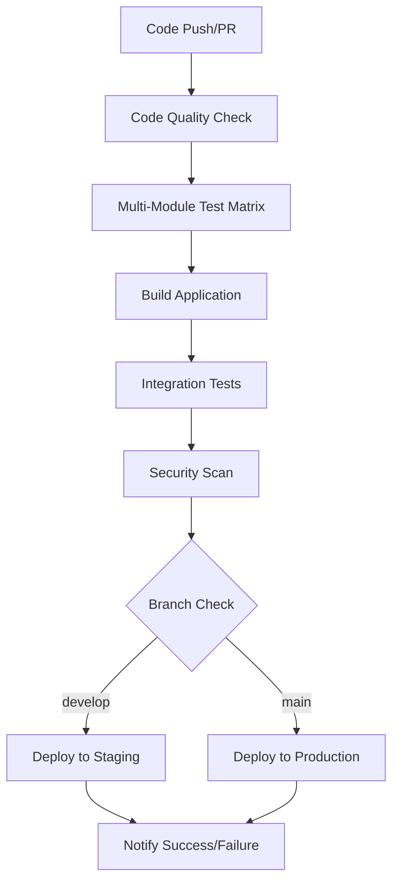
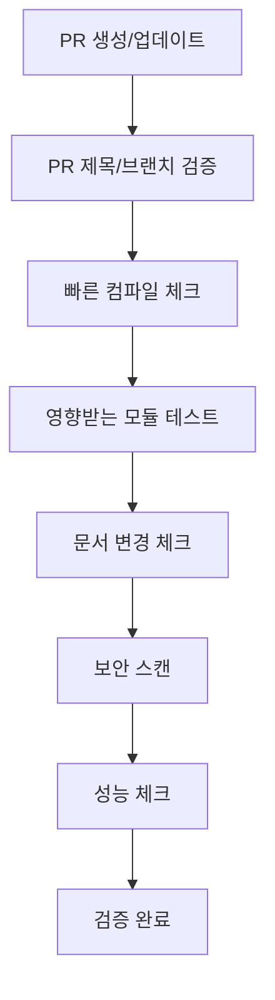
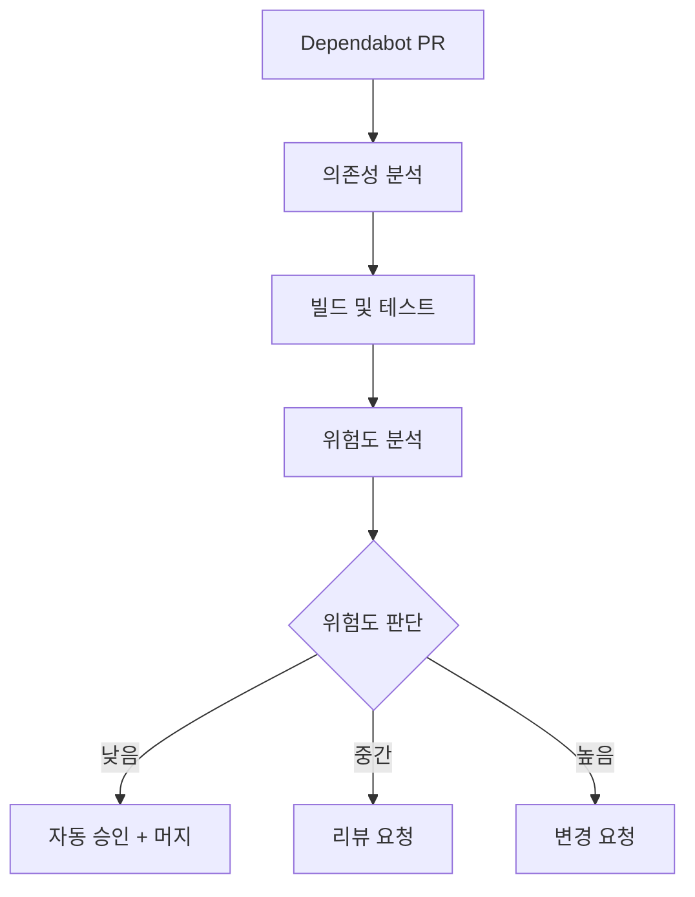
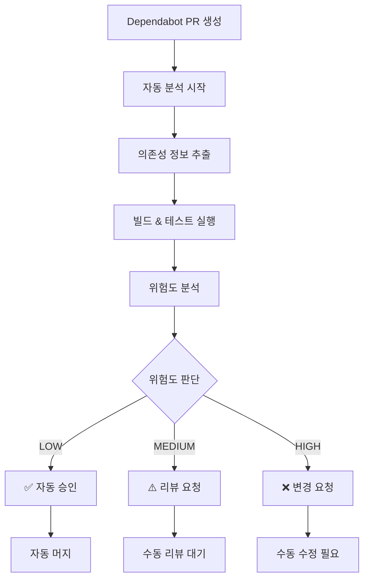

# 🚀 CI/CD 온보딩 가이드

> **Multi-Module E-Commerce Platform** CI/CD 파이프라인 완전 가이드

## 📋 목차

1. [CI/CD 개요](#cicd-개요)
2. [파이프라인 구조](#파이프라인-구조)
3. [브랜치별 플로우](#브랜치별-플로우)
4. [단계별 상세 설명](#단계별-상세-설명)
5. [PR 검증 프로세스](#pr-검증-프로세스)
6. [Dependabot 자동화](#dependabot-자동화)
7. [배포 프로세스](#배포-프로세스)
8. [트러블슈팅](#트러블슈팅)
9. [모니터링 및 알림](#모니터링-및-알림)

---

## 🎯 CI/CD 개요

### 핵심 원칙
- **안전성 우선**: 모든 변경사항은 검증 후 배포
- **자동화**: 반복 작업의 완전 자동화
- **빠른 피드백**: 문제 발생 시 즉시 알림
- **단계별 검증**: 각 단계에서 품질 확인

### 지원하는 워크플로우
```bash
feature → develop → staging → production
hotfix → main → production (긴급)
dependabot → 자동 분석 → 자동/수동 머지
```

---

## 🏗️ 파이프라인 구조

### 1. 메인 CI/CD 파이프라인 (`ci.yml`)



#### 실행 조건
- **Push**: `main`, `develop`, `feature/**`, `release/**`, `hotfix/**`
- **Pull Request**: `main`, `develop`로의 PR

#### 주요 단계
1. **Code Quality** (30초): 컴파일 검증
2. **Tests** (2-5분): 11개 모듈 병렬 테스트
3. **Build** (1-2분): JAR 빌드 및 아티팩트 생성
4. **Integration** (3-5분): PostgreSQL + Redis 통합 테스트
5. **Security** (1분): Trivy 보안 스캔
6. **Deploy** (환경별): 스테이징/프로덕션 배포

### 2. PR 검증 파이프라인 (`pr-checks.yml`)



#### 특징
- **빠른 피드백**: 5분 이내 결과
- **영향 범위 분석**: 변경된 모듈만 집중 테스트
- **자동 보안 검사**: 민감정보, SQL 인젝션 패턴 감지

### 3. Dependabot 자동화 (`dependabot-auto-review.yml`)



---

## 🌿 브랜치별 플로우

### Feature 브랜치 개발

```bash
# 1. 브랜치 생성
./scripts/10-branch-helper.sh feature my-awesome-feature

# 2. 개발 및 커밋
git add .
git commit -m "feat(api): add new endpoint for user management"

# 3. PR 생성 시 자동 실행되는 CI
```

**자동 실행되는 검증**:
- ✅ PR 제목 형식 검증 (Conventional Commits)
- ✅ 브랜치명 컨벤션 검증
- ✅ 빠른 컴파일 및 영향받는 모듈 테스트
- ✅ 보안 및 성능 체크

### Develop 브랜치 통합

```bash
# Feature PR 머지 시 자동 실행
```

**자동 실행되는 프로세스**:
- ✅ 전체 테스트 스위트 실행 (11개 모듈)
- ✅ 통합 테스트 (PostgreSQL + Redis)
- ✅ 보안 스캔
- ✅ **자동 스테이징 배포**
- ✅ 배포 결과 알림

### Main 브랜치 배포

```bash
# Release PR 머지 시 자동 실행
```

**자동 실행되는 프로세스**:
- ✅ 전체 품질 검증
- ✅ 보안 스캔
- ✅ **프로덕션 환경 배포** (수동 승인 필요)
- ✅ GitHub Release 자동 생성
- ✅ 배포 완료 알림

---

## 🔍 단계별 상세 설명

### 1. Code Quality & Security (30-60초)

```yaml
# 실행되는 작업들
./gradlew compileJava compileTestJava  # 컴파일 검증
```

**목적**: 기본적인 코드 품질 및 컴파일 가능성 확인  
**실패 조건**: 컴파일 오류, 문법 오류  
**대응**: 로컬에서 `./scripts/11-verify-build-modules.sh` 실행

### 2. Multi-Module Test Matrix (2-5분)

```yaml
# 11개 모듈 병렬 실행
matrix:
  module: [
    'common:common-core',
    'common:common-web', 
    'common:common-security',
    'domain:user-domain',
    'domain:product-domain', 
    'domain:order-domain',
    'infrastructure:data-access',
    'application:user-api',
    'application:batch-app'
  ]
```

**목적**: 각 모듈별 독립적 테스트 실행  
**특징**: 병렬 실행으로 시간 단축  
**실패 조건**: 단위 테스트 실패  
**대응**: `./scripts/13-test-api-endpoints.sh`로 특정 모듈 테스트

### 3. Integration Tests (3-5분)

```yaml
services:
  postgres:
    image: postgres:15
    env:
      POSTGRES_PASSWORD: testpassword
      POSTGRES_USER: testuser
      POSTGRES_DB: ecommerce_test

  redis:
    image: redis:7
```

**목적**: 실제 데이터베이스와 캐시 환경에서 통합 테스트  
**환경**: PostgreSQL 15 + Redis 7  
**테스트 범위**: 전체 애플리케이션 플로우  

### 4. Security Scan (1분)

```yaml
- uses: aquasecurity/trivy-action@master
  with:
    scan-type: 'fs'
    format: 'sarif'
```

**목적**: 의존성 취약점 및 보안 이슈 검출  
**도구**: Trivy 보안 스캐너  
**결과**: GitHub Security 탭에 자동 업로드  

---

## ✅ PR 검증 프로세스

### 자동 검증 항목

#### 1. 형식 검증
```bash
✅ PR 제목: feat(user): add user profile endpoint
✅ 브랜치명: feature/user-profile-api
✅ 커밋 메시지: Conventional Commits 형식
```

#### 2. 코드 품질 검증
```bash
✅ 컴파일 성공
✅ 영향받는 모듈 테스트 통과
✅ 빌드 성능 (5분 이내)
```

#### 3. 보안 검증
```bash
✅ 하드코딩된 비밀번호/키 없음
✅ SQL 인젝션 패턴 없음
✅ 민감정보 노출 없음
```

#### 4. 문서 검증
```bash
✅ API 변경 시 문서 업데이트 확인
✅ Breaking Change 감지 및 알림
```

### PR 상태별 대응

#### ✅ 모든 검증 통과
- 자동으로 머지 가능 상태
- 리뷰어 승인 후 머지 진행

#### ⚠️ 일부 검증 실패
- 실패한 검증 항목에 대한 상세 정보 제공
- 수정 후 자동으로 재검증

#### ❌ 중요 검증 실패
- PR 머지 차단
- 상세한 오류 정보 및 수정 가이드 제공

---

## 🤖 Dependabot 자동화

### 자동 처리 흐름



### 위험도 분류 기준

#### 🟢 LOW Risk (자동 승인)
- **패치 버전** 업데이트 (1.2.3 → 1.2.4)
- 빌드 및 테스트 모두 성공
- 보안 취약점 없음

```bash
# 예시
Bump junit from 5.8.2 to 5.8.3
→ 자동 승인 + 머지
```

#### 🟡 MEDIUM Risk (리뷰 요청)
- **마이너 버전** 업데이트 (1.2.x → 1.3.x)
- 빌드 성공하지만 수동 검토 필요

```bash
# 예시  
Bump spring-boot from 3.2.1 to 3.2.2
→ 리뷰 요청
```

#### 🔴 HIGH Risk (변경 요청)
- **메이저 버전** 업데이트 (1.x.x → 2.x.x)
- 빌드 또는 테스트 실패
- Breaking Changes 포함 가능

```bash
# 예시
Bump spring-boot from 3.1.x to 3.2.x  
→ 수동 검토 및 변경 필요
```

### 자동 분석 리포트 예시

```markdown
## 🤖 Automated Dependabot Review

**PR**: Bump spring-security from 6.1.5 to 6.1.6  
**Dependency**: spring-security-core  
**Update Type**: patch  
**Risk Level**: LOW  
**Version Change**: from 6.1.5 to 6.1.6  

### 🧪 Test Results

| Check | Status | Result |
|-------|--------|--------|
| Build | success | ✅ PASSED |
| Tests | success | ✅ PASSED |

### 📊 Analysis Summary

✅ **APPROVED**: Low-risk patch update with all tests passing. Safe to merge automatically.

### 🔍 Detailed Analysis

- **Compatibility**: High - Patch version update
- **Breaking Changes**: None expected
- **Testing Coverage**: Full test suite executed
- **Build Status**: Multi-module build verification completed
```

---

## 🚀 배포 프로세스

### 스테이징 배포 (develop → staging)

```yaml
# 자동 실행 조건
if: github.ref == 'refs/heads/develop'

# 배포 단계
steps:
  - name: Deploy to staging
    environment: staging  # GitHub Environment 보호
```

**특징**:
- develop 브랜치 푸시 시 자동 실행
- 사전 승인 불필요
- 실패 시 자동 롤백

### 프로덕션 배포 (main → production)

```yaml
# 자동 실행 조건  
if: github.ref == 'refs/heads/main'

# 배포 단계
steps:
  - name: Deploy to production
    environment: production  # 수동 승인 필요
```

**특징**:
- main 브랜치 푸시 시 실행
- **수동 승인 필수** (GitHub Environment 보호)
- 태그 생성 시 GitHub Release 자동 생성
- 배포 완료 시 알림 발송

### 배포 환경 설정

#### GitHub Environments
```yaml
# .github/environments/staging.yml
environment:
  name: staging
  url: https://staging.ecommerce.example.com

# .github/environments/production.yml  
environment:
  name: production
  url: https://ecommerce.example.com
  protection_rules:
    required_reviewers: true
    wait_timer: 5  # 5분 대기
```

---

## 🚨 트러블슈팅

### 자주 발생하는 문제들

#### 1. 빌드 실패

```bash
# 증상: Gradle 빌드 실패
❌ Task ':application:user-api:compileJava' FAILED

# 해결책
./scripts/12-build-diagnostics.sh  # 진단 실행
./scripts/11-verify-build-modules.sh  # 로컬 검증
```

#### 2. 테스트 실패

```bash
# 증상: 특정 모듈 테스트 실패
❌ Tests FAILED in module: user-domain

# 해결책
./gradlew :domain:user-domain:test --info  # 상세 로그
./scripts/13-test-api-endpoints.sh  # API 테스트
```

#### 3. 보안 스캔 실패

```bash
# 증상: Trivy 보안 스캔에서 취약점 발견
❌ HIGH: CVE-2023-12345 in dependency XYZ

# 해결책
./scripts/20-dependency-health-check.sh  # 의존성 점검
./scripts/21-dependabot-pr-analyzer.sh  # Dependabot 분석
```

#### 4. 배포 실패

```bash
# 증상: 스테이징/프로덕션 배포 실패
❌ Deploy to staging failed

# 해결책
1. GitHub Actions 로그 확인
2. 환경별 설정 검증  
3. 롤백 계획 실행
```

### 디버깅 도구

#### 로컬 디버깅
```bash
# 1. 전체 빌드 검증
./scripts/11-verify-build-modules.sh

# 2. 빌드 문제 진단
./scripts/12-build-diagnostics.sh  

# 3. API 테스트
./scripts/13-test-api-endpoints.sh

# 4. 의존성 체크
./scripts/20-dependency-health-check.sh
```

#### CI 로그 분석
```bash
# GitHub Actions 로그 다운로드
gh run list --workflow=ci.yml
gh run download <run-id>

# 로그 파일 분석
grep -r "ERROR\|FAILED" downloaded-logs/
```

---

## 📊 모니터링 및 알림

### 성공/실패 알림

#### 배포 성공 알림
```markdown
## Deployment Summary
- **Branch**: main  
- **Commit**: a1b2c3d
- **Author**: developer-name
- **Workflow**: Multi-Module E-Commerce CI/CD
✅ **Status**: Deployment successful!
```

#### 배포 실패 알림
```markdown  
## Deployment Summary
- **Branch**: develop
- **Commit**: x1y2z3w
- **Author**: developer-name  
- **Workflow**: Multi-Module E-Commerce CI/CD
❌ **Status**: Deployment failed!

**Error Details**: Build step failed in module user-api
**Action Required**: Review build logs and fix compilation errors
```

### GitHub 통합

#### Security Tab
- Trivy 스캔 결과 자동 업로드
- 취약점 트래킹 및 알림
- 의존성 보안 상태 대시보드

#### Actions Tab
- 모든 워크플로우 실행 기록
- 실패한 작업의 상세 로그
- 아티팩트 다운로드

#### Pull Requests
- 자동 상태 체크
- 머지 가능 여부 표시
- 리뷰 요청 자동 할당

---

## 📚 추가 리소스

### 관련 문서
- [Git Flow 워크플로우 가이드](DEVELOPMENT_WORKFLOW.md)
- [스크립트 실행 가이드](../scripts/README.md)
- [Dependabot 관리 가이드](../docs/DEPENDABOT_MANAGEMENT_GUIDE.md)

### 유용한 명령어
```bash
# CI 상태 확인
gh workflow list
gh workflow run ci.yml  

# PR 상태 확인
gh pr status
gh pr checks

# 배포 상태 확인
gh deployment list
```

### GitHub Actions 마켓플레이스
- [Setup Java](https://github.com/actions/setup-java)
- [Cache](https://github.com/actions/cache)  
- [Test Reporter](https://github.com/dorny/test-reporter)
- [Trivy Security Scanner](https://github.com/aquasecurity/trivy-action)

---

## ❓ FAQ

### Q: CI/CD가 너무 오래 걸려요
**A**: 다음을 확인해보세요:
- Gradle 캐시 상태 확인
- 테스트 병렬 실행 설정 확인  
- 불필요한 모듈 테스트 제외

### Q: Dependabot PR이 자동 머지되지 않아요
**A**: 다음을 확인해보세요:
- 위험도가 LOW인지 확인
- 모든 테스트가 통과했는지 확인
- 브랜치 보호 규칙 설정 확인

### Q: 배포가 실패했을 때 롤백하는 방법은?
**A**: 환경별 롤백 방법:
- **Staging**: 이전 커밋으로 새 배포 실행
- **Production**: GitHub Environment에서 이전 버전으로 롤백

### Q: 보안 스캔에서 오탐이 발견되었어요
**A**: 다음 방법으로 해결:
- `.trivyignore` 파일에 예외 추가
- 의존성 업데이트로 해결
- 수동으로 보안 이슈 검토 후 승인

---

**CI/CD 가이드 버전**: v1.0  
**최종 업데이트**: 2025-01-10  
**문의**: 프로젝트 README 참조

---

이 가이드를 통해 새로운 팀원들이 CI/CD 파이프라인을 완전히 이해하고 효과적으로 활용할 수 있습니다! 🚀