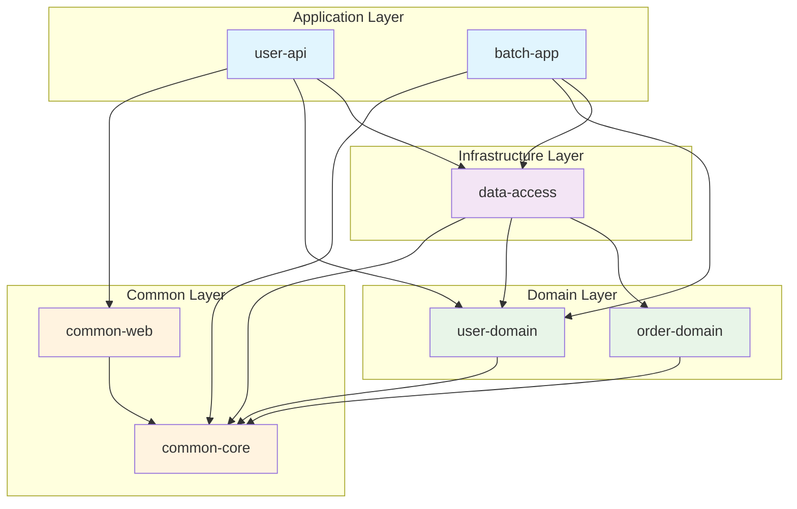

# 의존성 아키텍처 문서

## 1. 개요

이 문서는 멀티모듈 프로젝트의 의존성 구조와 관리 전략을 상세히 설명합니다. 의존성 방향, 모듈간 관계, 그리고 확장 가능한 아키텍처 설계 원칙을 다룹니다.

## 2. 의존성 아키텍처 원칙

### 2.1 핵심 원칙

1. **단방향 의존성**: 모듈 간 순환 의존성(Circular Dependency)을 금지
2. **계층별 의존성**: 상위 계층이 하위 계층에 의존, 역방향 의존성 금지
3. **의존성 역전 원칙(DIP)**: 구체적인 구현이 아닌 추상화에 의존
4. **최소 의존성 원칙**: 필요한 최소한의 의존성만 유지

### 2.2 의존성 방향 규칙

```
Application → Domain ← Infrastructure
     ↓           ↓
   Common ←─────┘
```

- **Domain**: 어떤 외부 모듈에도 의존하지 않음 (Common 제외)
- **Application**: Domain과 Infrastructure에 의존
- **Infrastructure**: Domain을 구현 (의존성 역전)
- **Common**: 모든 계층에서 공통으로 사용

## 3. 모듈별 의존성 구조

### 3.1 Common 모듈

#### common-core
```gradle
dependencies {
    implementation 'org.springframework.boot:spring-boot-starter'
    implementation 'org.springframework.boot:spring-boot-starter-validation'
    implementation 'org.apache.commons:commons-lang3'
}
```

**역할:**
- 전사 공통 기능 제공
- 외부 의존성 최소화
- 다른 모든 모듈의 기반 역할

**의존성 특징:**
- Spring Boot Core만 사용
- 비즈니스 로직 관련 의존성 없음
- 유틸리티 라이브러리만 포함

#### common-web
```gradle
dependencies {
    implementation project(':common:common-core')
    implementation 'org.springframework.boot:spring-boot-starter-web'
}
```

**역할:**
- 웹 계층 공통 기능
- REST API 표준 응답 형식
- 전역 예외 처리

**의존성 특징:**
- common-core에 의존
- Spring Web 스택 사용
- HTTP 관련 기능만 포함

### 3.2 Domain 모듈

#### user-domain
```gradle
dependencies {
    implementation project(':common:common-core')
    implementation 'org.springframework:spring-context'
}
```

**역할:**
- 사용자 관련 비즈니스 로직
- 도메인 모델 및 서비스
- 리포지토리 인터페이스 정의

**의존성 특징:**
- **순수한 비즈니스 로직**: 인프라스트럭처 의존성 없음
- **Spring Context만 사용**: @Service, @Component 등
- **데이터베이스 무관**: JPA나 특정 DB 기술에 의존하지 않음

#### order-domain
```gradle
dependencies {
    implementation project(':common:common-core')
    implementation 'org.springframework:spring-context'
}
```

**역할:**
- 주문 관련 비즈니스 로직
- 주문 도메인 모델 정의

**의존성 원칙:**
- user-domain과 동일한 의존성 패턴
- 다른 도메인 모듈과 직접 의존 관계 없음
- 필요시 Application 계층에서 조합

### 3.3 Infrastructure 모듈

#### data-access
```gradle
dependencies {
    implementation project(':common:common-core')
    implementation project(':domain:user-domain')
    implementation project(':domain:order-domain')
    implementation 'org.springframework.boot:spring-boot-starter-data-jpa'
    runtimeOnly 'com.h2database:h2'
}
```

**역할:**
- 데이터 영속성 구현
- Domain의 Repository Interface 구현
- JPA 엔티티와 도메인 모델 매핑

**의존성 특징:**
- **Domain Interface 구현**: Repository 인터페이스 구현체
- **기술 스택 포함**: JPA, Hibernate, Database Driver
- **매핑 책임**: Domain Model ↔ JPA Entity 변환

### 3.4 Application 모듈

#### user-api
```gradle
dependencies {
    implementation project(':common:common-web')
    implementation project(':domain:user-domain')
    implementation project(':infrastructure:data-access')
    
    implementation 'org.springframework.boot:spring-boot-starter-web'
    implementation 'org.springframework.boot:spring-boot-starter-data-jpa'
    implementation 'org.springframework.boot:spring-boot-starter-actuator'
    implementation 'org.springframework.boot:spring-boot-starter-validation'
    
    runtimeOnly 'com.h2database:h2'
}
```

**역할:**
- REST API 제공
- 사용자 요청 처리
- Domain 서비스 조합

**의존성 특징:**
- **모든 필요한 모듈 포함**: Common, Domain, Infrastructure
- **완전한 Spring Boot 스택**: Web, JPA, Actuator
- **실행 가능한 애플리케이션**: 독립적으로 실행 가능

#### batch-app
```gradle
dependencies {
    implementation project(':common:common-core')
    implementation project(':domain:user-domain')
    implementation project(':infrastructure:data-access')
    
    implementation 'org.springframework.boot:spring-boot-starter-batch'
    implementation 'org.springframework.boot:spring-boot-starter-data-jpa'
    
    runtimeOnly 'com.h2database:h2'
}
```

**역할:**
- 배치 처리 작업
- 대용량 데이터 처리
- 스케줄링 작업

**의존성 특징:**
- **배치 특화**: Spring Batch 스택 사용
- **웹 의존성 제외**: common-web 사용하지 않음
- **데이터 처리 중심**: Domain과 Infrastructure 활용

## 4. 의존성 관리 전략

### 4.1 BOM(Bill of Materials) 사용

```gradle
// 루트 build.gradle
subprojects {
    apply plugin: 'io.spring.dependency-management'
    
    dependencyManagement {
        imports {
            mavenBom 'org.springframework.boot:spring-boot-dependencies:3.2.2'
        }
    }
}
```

**장점:**
- **버전 일관성**: 모든 Spring 라이브러리 버전 자동 동기화
- **충돌 방지**: 호환되는 버전 조합 보장
- **관리 간소화**: 개별 버전 명시 불필요

### 4.2 플러그인 조건부 적용

```gradle
// Spring Boot 플러그인을 실행 가능한 애플리케이션에만 적용
configure(subprojects.findAll { it.name == 'user-api' || it.name == 'batch-app' }) {
    apply plugin: 'org.springframework.boot'
}

// 컨테이너 모듈들은 JAR 생성 비활성화
configure(subprojects.findAll { 
    it.name == 'common' || it.name == 'domain' || 
    it.name == 'infrastructure' || it.name == 'application' 
}) {
    tasks.named('jar') { enabled = false }
}
```

**이점:**
- **불필요한 빌드 방지**: 컨테이너 모듈의 불필요한 JAR 생성 방지
- **명확한 역할 분리**: 실행 가능한 모듈과 라이브러리 모듈 구분
- **빌드 최적화**: 필요한 작업만 수행

### 4.3 공통 의존성 관리

```gradle
// 루트 build.gradle
subprojects {
    dependencies {
        // 모든 모듈에서 사용하는 공통 의존성
        compileOnly 'org.projectlombok:lombok'
        annotationProcessor 'org.projectlombok:lombok'
        testImplementation 'org.springframework.boot:spring-boot-starter-test'
    }
}
```

## 5. 의존성 시각화

### 5.1 전체 의존성 그래프



### 5.2 계층별 의존성 매트릭스

| From\To | common-core | common-web | user-domain | order-domain | data-access | user-api | batch-app |
|---------|-------------|------------|-------------|--------------|-------------|----------|-----------|
| **common-core** | - | ❌ | ❌ | ❌ | ❌ | ❌ | ❌ |
| **common-web** | ✅ | - | ❌ | ❌ | ❌ | ❌ | ❌ |
| **user-domain** | ✅ | ❌ | - | ❌ | ❌ | ❌ | ❌ |
| **order-domain** | ✅ | ❌ | ❌ | - | ❌ | ❌ | ❌ |
| **data-access** | ✅ | ❌ | ✅ | ✅ | - | ❌ | ❌ |
| **user-api** | ❌ | ✅ | ✅ | ❌ | ✅ | - | ❌ |
| **batch-app** | ✅ | ❌ | ✅ | ❌ | ✅ | ❌ | - |

**범례:**
- ✅: 직접 의존성 있음
- ❌: 직접 의존성 없음

## 6. 의존성 검증 도구

### 6.1 의존성 분석 명령어

```bash
# 전체 의존성 트리 확인
./gradlew dependencies

# 특정 모듈의 컴파일 의존성
./gradlew :application:user-api:dependencies --configuration compileClasspath

# 의존성 충돌 확인
./gradlew :application:user-api:dependencyInsight --dependency spring-boot-starter-web

# 의존성 업데이트 확인
./gradlew dependencyUpdates
```

### 6.2 아키텍처 테스트 (ArchUnit)

```java
@AnalyzeClasses(packages = "com.example")
public class DependencyArchitectureTest {
    
    @ArchTest
    static final ArchRule domain_should_not_depend_on_infrastructure =
            noClasses().that().resideInAPackage("..domain..")
                    .should().dependOnClassesThat().resideInAPackage("..infrastructure..");
    
    @ArchTest
    static final ArchRule domain_should_only_depend_on_common =
            classes().that().resideInAPackage("..domain..")
                    .should().onlyDependOnClassesThat()
                    .resideInAnyPackage("..domain..", "..common..", "java..", "org.springframework.stereotype..");
    
    @ArchTest
    static final ArchRule infrastructure_should_implement_domain_interfaces =
            classes().that().resideInAPackage("..infrastructure..")
                    .and().implement(ClassPredicates.areInterfaces())
                    .should().resideInAPackage("..domain..");
}
```

### 6.3 의존성 검증 스크립트

```bash
#!/bin/bash
# scripts/validate-dependencies.sh

echo "=== 의존성 아키텍처 검증 ==="

# 1. 순환 의존성 확인
echo "1. 순환 의존성 검사"
./gradlew checkCircularDependencies

# 2. 모듈별 의존성 규칙 확인
echo "2. 도메인 모듈 의존성 확인"
DOMAIN_DEPS=$(./gradlew :domain:user-domain:dependencies --configuration compileClasspath --quiet)
echo "$DOMAIN_DEPS" | grep -q "infrastructure" && echo "❌ 도메인이 인프라에 의존!" || echo "✅ 도메인 의존성 정상"

# 3. 불필요한 의존성 확인
echo "3. 불필요한 의존성 검사"
./gradlew dependencyInsight --dependency unused

echo "의존성 검증 완료!"
```

## 7. 확장 시 의존성 고려사항

### 7.1 새로운 도메인 추가

```gradle
// product-domain 추가 시
dependencies {
    implementation project(':common:common-core')
    implementation 'org.springframework:spring-context'
    // user-domain에 직접 의존하지 않음!
}
```

**원칙:**
- 다른 도메인 모듈과 직접 의존 관계 생성 금지
- 도메인 간 상호작용은 Application 계층에서 처리
- 공통 기능은 Common 계층으로 승격

### 7.2 새로운 인프라 기술 추가

```gradle
// message-queue 모듈 추가 시
dependencies {
    implementation project(':common:common-core')
    implementation project(':domain:user-domain')
    implementation 'org.springframework.boot:spring-boot-starter-amqp'
}
```

**패턴:**
- Domain의 인터페이스를 구현
- 기술별로 별도 모듈 생성
- Application에서 필요한 구현체 선택

### 7.3 외부 서비스 연동

```gradle
// external-api 모듈 추가 시
dependencies {
    implementation project(':common:common-core')
    implementation project(':domain:user-domain')
    implementation 'org.springframework.boot:spring-boot-starter-webflux'
    implementation 'org.springframework.cloud:spring-cloud-starter-openfeign'
}
```

## 8. 의존성 최적화 전략

### 8.1 선택적 의존성(Optional Dependencies)

```gradle
dependencies {
    // 선택적 의존성으로 표시
    compileOnly 'org.springframework.boot:spring-boot-starter-security'
    
    // 조건부 자동 설정
    implementation 'org.springframework.boot:spring-boot-autoconfigure'
}
```

### 8.2 Profile별 의존성

```gradle
dependencies {
    implementation 'org.springframework.boot:spring-boot-starter-data-jpa'
    
    // 개발환경용
    developmentOnly 'org.springframework.boot:spring-boot-devtools'
    
    // 운영환경용 데이터베이스
    runtimeOnly 'org.postgresql:postgresql'
    
    // 테스트환경용
    testImplementation 'org.testcontainers:postgresql'
}
```

### 8.3 버전 카탈로그 활용 (Gradle 7.0+)

```toml
# gradle/libs.versions.toml
[versions]
spring-boot = "3.2.2"
lombok = "1.18.30"
mapstruct = "1.5.5.Final"

[libraries]
spring-boot-starter-web = { module = "org.springframework.boot:spring-boot-starter-web", version.ref = "spring-boot" }
lombok = { module = "org.projectlombok:lombok", version.ref = "lombok" }

[bundles]
spring-web = ["spring-boot-starter-web", "spring-boot-starter-validation"]
```

## 9. 모니터링 및 관리

### 9.1 의존성 변경 추적

```bash
# 의존성 변경 사항 확인
git diff HEAD~1 -- '**/build.gradle'

# 의존성 트리 비교
./gradlew dependencies > deps-before.txt
# 변경 후
./gradlew dependencies > deps-after.txt
diff deps-before.txt deps-after.txt
```

### 9.2 보안 취약점 스캔

```gradle
plugins {
    id 'org.owasp.dependencycheck' version '8.4.0'
}

dependencyCheck {
    format = 'ALL'
    suppressionFile = 'config/dependency-check-suppressions.xml'
}
```

### 9.3 라이선스 관리

```gradle
plugins {
    id 'com.github.jk1.dependency-license-report' version '2.5'
}

licenseReport {
    allowedLicensesFile = 'config/allowed-licenses.json'
}
```

---

이 의존성 아키텍처를 통해 확장 가능하고 유지보수가 용이한 멀티모듈 프로젝트를 구축할 수 있습니다.
의존성 규칙을 준수하여 깨끗한 아키텍처를 유지하는 것이 중요합니다.