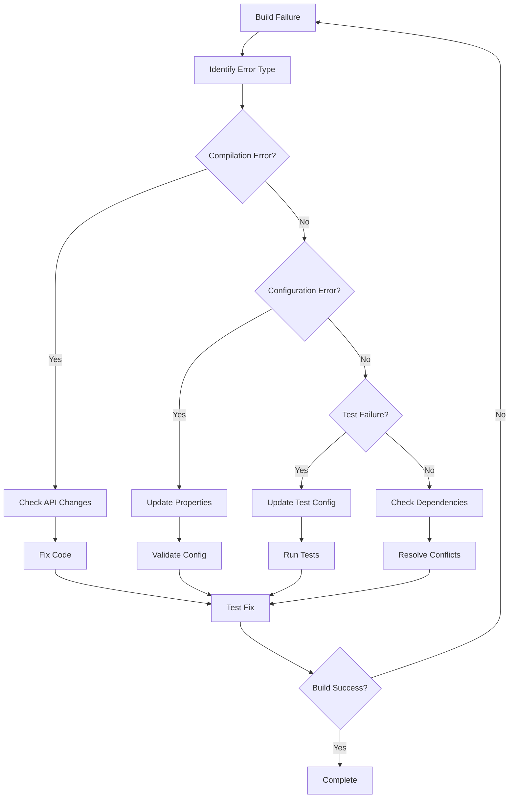

# Dependabot Management Guide

## Overview

This guide provides comprehensive strategies for managing Dependabot PRs in the multi-module Spring Boot project, with emphasis on failure analysis, systematic updates, and automated review processes.

## Table of Contents

1. [Current Project Analysis](#current-project-analysis)
2. [Dependency Update Strategies](#dependency-update-strategies)
3. [Build Failure Analysis](#build-failure-analysis)
4. [Automated PR Review System](#automated-pr-review-system)
5. [Tools and Scripts](#tools-and-scripts)
6. [Troubleshooting Guide](#troubleshooting-guide)

## Current Project Analysis

### Project Structure
```
multi-module-example-1/
├── build.gradle (Root configuration)
├── settings.gradle (Module definitions)
├── common/ (Shared utilities)
│   ├── common-core/
│   ├── common-web/
│   ├── common-cache/
│   └── common-security/
├── domain/ (Business logic)
│   ├── user-domain/
│   ├── order-domain/
│   └── product-domain/
├── infrastructure/ (Data access)
│   ├── data-access/
│   └── cache-infrastructure/
└── application/ (Runnable apps)
    ├── user-api/
    └── batch-app/
```

### Current Dependency Versions
```gradle
// build.gradle - Key versions
Spring Boot: 3.2.2
Java: 17
QueryDSL: 5.0.0
JJWT: 0.12.3
Redisson: 3.24.3
Hibernate Types: 2.21.1
```

### Dependency Dependencies Analysis
- **Spring Boot 3.2.2**: Stable version with good ecosystem support
- **Multi-module complexity**: 17 modules with interdependencies
- **Key integrations**: Security (JWT), Caching (Redis/Redisson), Data (JPA/QueryDSL)

## Dependency Update Strategies

### 1. Risk-Based Update Approach

#### Low Risk Updates (Patch versions)
**Pattern**: `x.y.Z` updates
**Example**: `3.2.2 → 3.2.5`

**Characteristics**:
- Bug fixes only
- No breaking changes
- Minimal testing required

**Auto-merge Criteria**:
- All tests pass
- No compilation errors
- Security patches
- Documentation confirms no breaking changes

#### Medium Risk Updates (Minor versions)
**Pattern**: `x.Y.z` updates  
**Example**: `3.2.2 → 3.3.0`

**Characteristics**:
- New features added
- Possible deprecations
- Configuration changes possible

**Review Requirements**:
- Manual code review
- Extended test suite
- Configuration validation
- Performance testing

#### High Risk Updates (Major versions)
**Pattern**: `X.y.z` updates
**Example**: `3.2.2 → 4.0.0`

**Characteristics**:
- Breaking changes expected
- API modifications
- Configuration overhauls

**Thorough Review Required**:
- Architecture impact analysis
- Migration planning
- Extensive testing
- Staged rollout

### 2. Systematic Update Process

#### Phase 1: Foundation Updates
1. **Java Runtime**
   - Update JDK if required
   - Test compatibility with build tools
   
2. **Build System** 
   - Gradle wrapper updates
   - Plugin compatibility checks

3. **Spring Boot Core**
   - Boot starter updates
   - Dependency management BOM

#### Phase 2: Infrastructure Updates  
1. **Data Layer**
   - JPA/Hibernate updates
   - Database driver updates
   - QueryDSL compatibility
   
2. **Caching Layer**
   - Redis client updates
   - Redisson compatibility
   - Cache configuration

#### Phase 3: Security Updates
1. **Authentication**
   - JWT library updates
   - Spring Security updates
   
2. **Authorization**
   - Method security updates
   - Configuration compatibility

#### Phase 4: Application Updates
1. **Web Layer**
   - Spring MVC updates
   - Validation updates
   
2. **Batch Processing**
   - Spring Batch updates
   - Scheduling updates

### 3. Version Compatibility Matrix

| Component | Current | Compatible With SB 3.3 | Compatible With SB 3.4 | Compatible With SB 3.5 |
|-----------|---------|------------------------|------------------------|------------------------|
| Java 17 | ✅ Current | ✅ Supported | ✅ Supported | ✅ Supported |
| Java 21 | ❌ Not used | ⚠️ Recommended | ✅ Recommended | ✅ Required |
| QueryDSL 5.0.0 | ✅ Current | ⚠️ Update to 5.1+ | ⚠️ Update to 5.1+ | ❌ Update Required |
| JJWT 0.12.3 | ✅ Current | ✅ Compatible | ✅ Compatible | ✅ Compatible |
| Redisson 3.24.3 | ✅ Current | ⚠️ Check 3.27+ | ⚠️ Update to 3.28+ | ❌ Update Required |
| Hibernate Types | ✅ Current | ⚠️ Deprecated | ❌ Replace | ❌ Replace |

## Build Failure Analysis

### Common Failure Patterns

#### 1. Compilation Failures
**Symptoms**:
```
error: cannot find symbol
error: method does not exist
error: incompatible types
```

**Common Causes**:
- API changes in updated dependencies
- Removed or renamed methods
- Changed method signatures

**Resolution Strategy**:
1. Check changelogs for breaking changes
2. Update code to use new APIs
3. Add compatibility layers if needed

#### 2. Spring Boot Auto-configuration Failures
**Symptoms**:
```
APPLICATION FAILED TO START
Parameter 0 of constructor required a bean that could not be found
```

**Common Causes**:
- Configuration property changes
- Bean definition changes
- Auto-configuration conditions modified

**Resolution Strategy**:
1. Review Spring Boot migration guide
2. Update application.yml properties
3. Add explicit bean configurations

#### 3. Test Failures
**Symptoms**:
```
Tests run: X, Failures: Y, Errors: Z, Skipped: A
MockMvc setup failures
Context loading errors
```

**Common Causes**:
- Test configuration incompatibility
- Mock framework changes
- Spring Test context changes

**Resolution Strategy**:
1. Update test configurations
2. Review test slice annotations
3. Update mock setups

#### 4. Plugin Compatibility Issues
**Symptoms**:
```
Plugin [id: 'x'] was not found
Plugin version 'x' is not compatible
```

**Common Causes**:
- Gradle plugin version incompatibility
- Plugin API changes
- Build script syntax changes

**Resolution Strategy**:
1. Update plugin versions
2. Check Gradle compatibility
3. Update build script syntax

### Failure Analysis Workflow



## Automated PR Review System

### Review Automation Levels

#### Level 1: Automated Checks (No Human Review)
**Criteria**:
- Patch version updates only
- All tests pass
- No breaking changes documented
- Security patches

**Actions**:
- Automatic approval
- Auto-merge after CI passes
- Notification sent

#### Level 2: Assisted Review (Light Human Review)
**Criteria**:
- Minor version updates
- Tests pass
- Minor breaking changes
- Well-documented changes

**Actions**:
- Auto-comment with analysis
- Request human approval
- Provide migration notes

#### Level 3: Manual Review (Full Human Review)
**Criteria**:
- Major version updates
- Breaking changes present
- Test failures
- Security implications

**Actions**:
- Comprehensive analysis report
- Manual review required
- Migration guide provided

### PR Review Checklist

#### Automated Checks ✅
- [ ] Build passes successfully
- [ ] All tests pass (unit, integration)
- [ ] No compilation errors
- [ ] Dependency compatibility verified
- [ ] Security vulnerabilities addressed

#### Version Analysis ✅
- [ ] Changelog reviewed for breaking changes
- [ ] Version compatibility matrix checked
- [ ] Deprecated API usage identified
- [ ] Migration requirements documented

#### Configuration Review ✅
- [ ] Application properties compatibility
- [ ] Spring Boot configuration changes
- [ ] Security configuration impact
- [ ] Database migration requirements

#### Risk Assessment ✅
- [ ] Performance impact evaluated
- [ ] Security implications assessed
- [ ] Backward compatibility verified
- [ ] Rollback strategy defined

## Tools and Scripts

### 1. Dependabot PR Analyzer
**Location**: `scripts/dependabot-pr-analyzer.sh`

**Features**:
- Comprehensive dependency analysis
- Build failure prediction
- Compatibility matrix generation
- Risk assessment automation

**Usage**:
```bash
# Full analysis
./scripts/dependabot-pr-analyzer.sh

# Build test only
./scripts/dependabot-pr-analyzer.sh --build-test

# Dependency analysis only
./scripts/dependabot-pr-analyzer.sh --analyze-deps
```

### 2. Automated PR Review Script
**Location**: `scripts/auto-review-dependabot-pr.sh`

**Features**:
- Automatic PR checkout and testing
- Risk level assessment
- Automated review comments
- Approval/rejection automation

**Usage**:
```bash
# Review specific PR
./scripts/auto-review-dependabot-pr.sh 123

# Review all open Dependabot PRs
for pr in $(gh pr list --author=app/dependabot --json number -q '.[].number'); do
  ./scripts/auto-review-dependabot-pr.sh $pr
done
```

### 3. Build Diagnostics Tool
**Location**: `scripts/build-diagnostics.sh`

**Features**:
- Comprehensive build failure analysis
- System compatibility checking
- Dependency conflict detection
- Configuration validation

**Usage**:
```bash
# Full diagnostics
./scripts/build-diagnostics.sh

# Quick system check
./scripts/build-diagnostics.sh --system-info

# Dependency analysis only
./scripts/build-diagnostics.sh --deps-only
```

### 4. GitHub Actions Integration

**Workflow File**: `.github/workflows/dependabot-auto-review.yml`

```yaml
name: Dependabot Auto Review

on:
  pull_request:
    types: [opened, synchronize]

jobs:
  auto-review:
    if: github.actor == 'dependabot[bot]'
    runs-on: ubuntu-latest
    
    steps:
      - uses: actions/checkout@v4
      
      - name: Set up JDK 17
        uses: actions/setup-java@v4
        with:
          java-version: '17'
          distribution: 'temurin'
          
      - name: Run Dependabot Analysis
        run: |
          chmod +x ./scripts/dependabot-pr-analyzer.sh
          ./scripts/dependabot-pr-analyzer.sh --build-test
          
      - name: Auto Review PR
        env:
          GITHUB_TOKEN: ${{ secrets.GITHUB_TOKEN }}
        run: |
          chmod +x ./scripts/auto-review-dependabot-pr.sh
          ./scripts/auto-review-dependabot-pr.sh ${{ github.event.number }}
```

## Troubleshooting Guide

### Common Issues and Solutions

#### Issue 1: Spring Boot Version Conflicts
**Symptoms**: 
- Multiple Spring Boot versions in dependency tree
- ClassNotFoundException for Spring components
- Auto-configuration conflicts

**Solution**:
```gradle
// In build.gradle, enforce Spring Boot BOM
dependencyManagement {
    imports {
        mavenBom "org.springframework.boot:spring-boot-dependencies:${springBootVersion}"
    }
}

// Check for conflicts
./gradlew dependencyInsight --dependency org.springframework.boot
```

#### Issue 2: QueryDSL Generation Failures
**Symptoms**:
- Q-classes not generated
- Compilation errors in repositories
- APT processor not running

**Solution**:
```gradle
// Update QueryDSL configuration
dependencies {
    implementation 'com.querydsl:querydsl-jpa:5.1.0:jakarta'
    annotationProcessor 'com.querydsl:querydsl-apt:5.1.0:jakarta'
    annotationProcessor 'jakarta.persistence:jakarta.persistence-api'
}

// Clean and regenerate
./gradlew clean build
```

#### Issue 3: JWT Token Parsing Errors
**Symptoms**:
- Authentication failures
- Token parsing exceptions
- Security configuration errors

**Solution**:
```java
// Update JWT configuration for newer JJWT versions
@Configuration
public class JwtConfig {
    
    // Use new builder API
    private Key getSigningKey() {
        return Keys.hmacShaKeyFor(jwtSecret.getBytes(StandardCharsets.UTF_8));
    }
    
    // Update parser configuration
    private JwtParser getJwtParser() {
        return Jwts.parserBuilder()
                .setSigningKey(getSigningKey())
                .build();
    }
}
```

#### Issue 4: Redis/Redisson Connection Issues
**Symptoms**:
- Redis connection failures
- Cache operations failing
- Configuration property errors

**Solution**:
```yaml
# Update application.yml for newer Redisson
spring:
  data:
    redis:
      redisson:
        config: |
          singleServerConfig:
            address: redis://localhost:6379
            database: 0
            timeout: 3000
```

### Emergency Rollback Procedures

#### 1. Quick Rollback
```bash
# Revert to last known good commit
git revert HEAD
git push origin main

# Or reset to specific commit
git reset --hard <last-good-commit>
git push --force-with-lease origin main
```

#### 2. Selective Dependency Rollback
```gradle
// In build.gradle, pin problematic dependency
dependencies {
    implementation('com.problematic:dependency') {
        version {
            strictly '1.2.3' // Known good version
        }
    }
}
```

#### 3. Gradual Rollback Strategy
1. Identify failing component
2. Rollback just that dependency
3. Test isolated change
4. Apply fix incrementally

### Monitoring and Alerting

#### Build Health Monitoring
- Set up build notifications for failures
- Monitor dependency vulnerability alerts
- Track update success rates

#### Performance Monitoring
- Monitor application performance after updates
- Set up alerting for degradation
- Track resource usage changes

#### Security Monitoring
- Monitor for new vulnerabilities
- Track security patch applications
- Verify security configurations

## Best Practices

### 1. Update Strategy
- **Small, frequent updates** over large batch updates
- **Test in staging** before production deployment
- **Staged rollout** for major updates
- **Rollback ready** with quick revert procedures

### 2. Testing Strategy
- **Comprehensive test suite** with good coverage
- **Integration testing** for multi-module dependencies
- **Performance testing** for significant updates
- **Security testing** for security-related updates

### 3. Documentation Strategy
- **Update logs** for all dependency changes
- **Migration guides** for breaking changes
- **Configuration changes** documented
- **Rollback procedures** always available

### 4. Automation Strategy
- **Automate safe updates** (patches, security fixes)
- **Semi-automate risky updates** with human oversight
- **Manual review for breaking changes**
- **Continuous monitoring** of update success

## Conclusion

This comprehensive guide provides the framework for systematic Dependabot PR management in the multi-module Spring Boot project. The combination of automated tools, risk-based strategies, and thorough testing procedures ensures reliable dependency updates while minimizing disruption to the development workflow.

Key success factors:
1. **Risk assessment** drives the review process
2. **Automation** handles routine updates
3. **Comprehensive testing** catches issues early
4. **Quick rollback** procedures minimize downtime
5. **Continuous monitoring** ensures ongoing stability

Regular review and updates of this guide ensure it remains current with evolving dependency management practices and project needs.