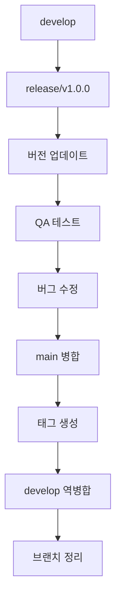
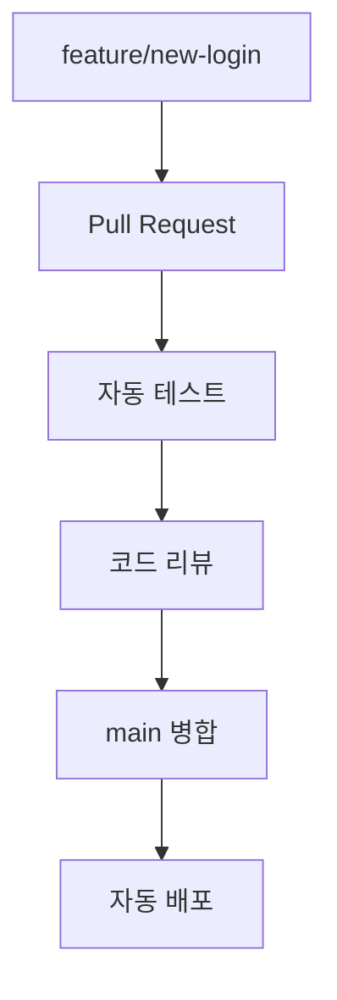

# GitHub Flow 마이그레이션 변화 사항 문서

이 문서는 Git Flow에서 GitHub Flow로 마이그레이션할 때 발생하는 모든 변화사항을 상세히 기록합니다.

## 목차
1. [마이그레이션 개요](#마이그레이션-개요)
2. [브랜치 구조 변화](#브랜치-구조-변화)
3. [워크플로우 변화](#워크플로우-변화)
4. [파일 시스템 변화](#파일-시스템-변화)
5. [CI/CD 파이프라인 변화](#cicd-파이프라인-변화)
6. [팀 작업 방식 변화](#팀-작업-방식-변화)
7. [도구 및 스크립트 변화](#도구-및-스크립트-변화)
8. [안전장치 및 백업](#안전장치-및-백업)
9. [성능 및 효율성 개선](#성능-및-효율성-개선)
10. [위험 요소 및 대응책](#위험-요소-및-대응책)

## 마이그레이션 개요

### 마이그레이션 목표
- **복잡성 감소**: 5개 브랜치 타입 → 2개 브랜치 타입
- **개발 속도 향상**: 수동 과정 → 자동화된 과정
- **실수 위험 최소화**: 복잡한 수동 병합 → 간단한 PR 병합
- **현대적 워크플로우**: 계획된 릴리스 → 지속적 배포

### 마이그레이션 전략
```
Phase 1: 준비 및 백업 (1-2일)
Phase 2: 브랜치 구조 조정 (2-3일)
Phase 3: 워크플로우 전환 (1주)
Phase 4: develop 브랜치 단계적 제거 (3-5일)
Phase 5: 최적화 및 안정화 (1-2주)
```

## 브랜치 구조 변화

### 기존 구조 (Git Flow)
```
Repository
├── main (production)
│   └── Tags: v1.0.0, v1.1.0, v1.2.0
├── develop (integration)
│   ├── feature/user-management
│   ├── feature/order-processing  
│   └── feature/payment-integration
├── release/v1.3.0 (release preparation)
├── hotfix/security-patch (emergency fixes)
└── support/legacy-version (long-term support)
```

### 새로운 구조 (GitHub Flow)
```
Repository
├── main (production + development)
│   ├── Tags: v1.0.0, v1.1.0, v1.2.0, v1.3.0+
│   ├── feature/user-authentication
│   ├── feature/api-optimization
│   ├── bugfix/login-timeout
│   ├── docs/api-documentation
│   └── refactor/database-layer
```

### 브랜치 타입 매핑
| Git Flow | GitHub Flow | 변화 |
|----------|-------------|------|
| `main` | `main` | 역할 확장 (production + development base) |
| `develop` | 삭제 | main으로 통합 |
| `feature/*` | `feature/*` | 동일 (base만 develop → main) |
| `release/*` | 삭제 | 지속적 배포로 대체 |
| `hotfix/*` | `bugfix/*` | 이름 변경, 동일한 기능 |
| `support/*` | 삭제 | 필요시 별도 브랜치로 관리 |

## 워크플로우 변화

### 기능 개발 워크플로우 비교

#### Before (Git Flow - 13단계):
```bash
# 1. 기능 시작 (3단계)
git checkout develop
git pull origin develop  
git checkout -b feature/user-auth

# 2. 개발 과정 (4단계)
# ... 코드 작성 ...
git add .
git commit -m "feat: implement user auth"
git push -u origin feature/user-auth

# 3. 기능 완료 (6단계)
git checkout develop
git pull origin develop
git merge --no-ff feature/user-auth
git push origin develop
git branch -d feature/user-auth
git push origin --delete feature/user-auth

# 총 13단계, 예상 시간: 2-3분
```

#### After (GitHub Flow - 4단계):
```bash
# 1. 기능 시작 (1단계)
gf_start user-auth  # 내부적으로 3개 git 명령 실행

# 2. 개발 과정 (2단계)
# ... 코드 작성 ...
git add . && git commit -m "feat: implement user auth"

# 3. PR 생성 및 병합 (1단계)
gf_pr "Add user authentication" "Implements secure login system"

# 총 4단계, 예상 시간: 30초-1분
```

### 릴리스 워크플로우 변화

#### Before (Git Flow):


#### After (GitHub Flow):


## 파일 시스템 변화

### 새로 생성되는 파일들

#### 1. GitHub 워크플로우 설정
```
.github/
├── pull_request_template.md      # PR 템플릿
└── workflows/
    ├── github-flow.yml           # 새로운 CI/CD 파이프라인
    └── *.yml.backup-*           # 기존 워크플로우 백업
```

**pull_request_template.md 내용:**
```markdown
## 변경 내용
- [ ] 새로운 기능
- [ ] 버그 수정
- [ ] 문서 업데이트
- [ ] 리팩토링

## 설명
<!-- 변경 사항 설명 -->

## 테스트
- [ ] 단위 테스트 통과
- [ ] 통합 테스트 통과
- [ ] 수동 테스트 완료
```

#### 2. 자동화 스크립트들
```
scripts/
├── migrate-to-github-flow.sh     # 마이그레이션 실행 스크립트
├── github-flow-helpers.sh        # 일상 작업 도우미 함수들
├── github-flow-start.sh          # 기능 시작 스크립트
└── cleanup-branches.sh           # 브랜치 정리 스크립트
```

#### 3. 문서화
```
docs/
├── github-flow-migration-guide.md     # 마이그레이션 가이드
├── github-flow-migration-changes.md   # 이 문서
└── github-flow-workflow-guide.md      # 새로운 워크플로우 가이드
```

### 수정되는 파일들

#### 1. CI/CD 워크플로우 변화
**Before (.github/workflows/ci.yml):**
```yaml
name: CI
on:
  push:
    branches: [ main, develop ]
  pull_request:
    branches: [ develop ]

jobs:
  test:
    runs-on: ubuntu-latest
    steps:
      - uses: actions/checkout@v4
      - name: Test
        run: ./gradlew test
        
  deploy-staging:
    if: github.ref == 'refs/heads/develop'
    needs: test
    runs-on: ubuntu-latest
    steps:
      - name: Deploy to staging
        run: echo "Deploy to staging"
        
  deploy-production:
    if: github.ref == 'refs/heads/main'  
    needs: test
    runs-on: ubuntu-latest
    steps:
      - name: Deploy to production
        run: echo "Deploy to production"
```

**After (.github/workflows/github-flow.yml):**
```yaml
name: GitHub Flow CI/CD
on:
  push:
    branches: [ main ]
  pull_request:
    branches: [ main ]

jobs:
  test:
    runs-on: ubuntu-latest
    steps:
      - uses: actions/checkout@v4
      - name: Setup Java
        uses: actions/setup-java@v4
        with:
          java-version: '17'
      - name: Test
        run: ./gradlew test
      - name: Build
        run: ./gradlew build

  deploy:
    if: github.ref == 'refs/heads/main' && github.event_name == 'push'
    needs: test
    runs-on: ubuntu-latest
    environment: production
    steps:
      - name: Deploy to production
        run: |
          echo "🚀 Deploying to production..."
          # Feature flags를 통한 점진적 배포
          echo "✅ Deployment completed"
```

#### 2. README.md 업데이트 (선택사항)
```markdown
## 개발 워크플로우

### GitHub Flow 사용
이 프로젝트는 GitHub Flow를 사용합니다.

#### 새 기능 개발:
```bash
# 헬퍼 함수 사용 (권장)
source scripts/github-flow-helpers.sh
gf_start new-feature

# 또는 직접 명령어
git checkout main
git pull origin main  
git checkout -b feature/new-feature
```

#### Pull Request 생성:
```bash
gf_pr "Add new feature" "Feature description"
# 또는
gh pr create --title "Add new feature" --body "Description"
```
```

## CI/CD 파이프라인 변화

### 파이프라인 아키텍처 변화

#### Before (Git Flow CI/CD):
```
feature/* → develop (Staging Deploy)
             ↓
          release/* (QA Testing)
             ↓  
           main (Production Deploy)
```

#### After (GitHub Flow CI/CD):
```
feature/* → Pull Request (Test + Review) → main (Production Deploy)
```

### 배포 전략 변화

#### Before: 주기적 릴리스
- 개발 → 스테이징 → QA → 프로덕션
- 릴리스 브랜치에서 최종 검증
- 주/월 단위 배포

#### After: 지속적 배포
- 개발 → 리뷰 → 프로덕션  
- Feature flags를 통한 점진적 배포
- 일/시간 단위 배포

### 자동화 수준 비교

| 단계 | Git Flow | GitHub Flow | 개선점 |
|------|----------|-------------|--------|
| **브랜치 생성** | 3개 명령어 | 1개 함수 호출 | 67% 감소 |
| **코드 리뷰** | 선택사항 | 필수 (PR) | 품질 향상 |
| **테스트** | 수동/반자동 | 자동 | 완전 자동화 |
| **병합** | 6개 명령어 | 웹 클릭 1회 | 83% 감소 |
| **배포** | 수동 트리거 | 자동 트리거 | 완전 자동화 |
| **브랜치 정리** | 수동 | 자동/스크립트 | 완전 자동화 |

## 팀 작업 방식 변화

### 개발자 워크플로우 변화

#### Before (Git Flow):
1. **기능 할당 받음**
2. `develop` 브랜치에서 `feature` 브랜치 생성
3. 개발 및 커밋
4. `develop`으로 수동 병합
5. 브랜치 수동 정리
6. 릴리스 매니저가 별도로 릴리스 관리

#### After (GitHub Flow):
1. **기능 할당 받음**
2. `main` 브랜치에서 `feature` 브랜치 생성 (헬퍼 함수 사용)
3. 개발 및 커밋
4. Pull Request 생성 (자동화)
5. 코드 리뷰 참여
6. 병합 후 자동 정리

### 코드 리뷰 프로세스 변화

#### Before:
- 선택적 리뷰 (팀에 따라)
- 병합 후 리뷰 가능
- 리뷰 도구 별도 사용

#### After:
- 모든 변경사항 필수 리뷰
- 병합 전 리뷰 강제
- GitHub PR 통합 리뷰

### 릴리스 매니저 역할 변화

#### Before:
- 릴리스 브랜치 관리
- 버전 관리
- QA 조율
- 수동 배포 관리

#### After:
- Feature flags 관리
- 배포 모니터링
- 롤백 관리  
- 자동화 시스템 관리

## 도구 및 스크립트 변화

### 새로운 헬퍼 함수들

#### 1. 기본 워크플로우 함수
```bash
# 기능 개발 시작
gf_start() {
    local feature_name=$1
    git checkout main
    git pull origin main
    git checkout -b "feature/$feature_name"
}

# Pull Request 생성
gf_pr() {
    local title=$1
    local body=$2
    git push -u origin "$(git branch --show-current)"
    gh pr create --title "$title" --body "$body"
}

# 브랜치 정리
gf_cleanup() {
    git checkout main
    git pull origin main
    git branch --merged main | grep -v "main" | xargs git branch -d
    git remote prune origin
}
```

#### 2. 상태 확인 함수
```bash
# 현재 상태 확인
gf_status() {
    echo "현재 브랜치: $(git branch --show-current)"
    echo "미완료 변경사항:"
    git status --short
    echo "진행 중인 브랜치들:"
    git branch --list "feature/*" "bugfix/*"
}
```

### 별칭 설정
```bash
# ~/.bashrc 또는 ~/.zshrc에 추가
alias gfs='gf_start'      # 기능 시작
alias gfp='gf_pr'         # PR 생성  
alias gfc='gf_cleanup'    # 브랜치 정리
alias gfst='gf_status'    # 상태 확인
```

### IDE 통합 변화

#### VS Code 확장
- **Git Flow**: 제거 또는 비활성화
- **GitHub Pull Requests**: 활성화 및 설정
- **GitHub Actions**: 워크플로우 모니터링

#### IntelliJ IDEA 설정
```
File → Settings → Version Control → GitHub
✓ Clone git repositories using ssh
✓ Add unversioned files to VCS 
✓ Use credential helper
```

## 안전장치 및 백업

### 자동 백업 시스템

#### 1. 마이그레이션 전 백업
```bash
# 마이그레이션 스크립트에 의해 자동 생성
backup_tag="backup-before-github-flow-$(date +%Y%m%d-%H%M%S)"
git tag "$backup_tag"
git push origin "$backup_tag"
```

#### 2. 워크플로우 백업
```bash
# 기존 워크플로우 파일들 백업
backup_dir=".github/workflows.backup-$(date +%Y%m%d-%H%M%S)"
cp -r .github/workflows "$backup_dir"
```

### 롤백 절차

#### 즉시 롤백
```bash
# 심각한 문제 발생 시
git reset --hard backup-before-github-flow-20250810-143000
git push --force-with-lease origin main

# develop 브랜치 복구 (삭제했다면)
git checkout -b develop backup-before-github-flow-20250810-143000
git push -u origin develop
```

#### 점진적 롤백
```bash
# 특정 기능만 되돌리기
git revert <problematic-commit-hash>
git push origin main
```

### 안전 확인 체크리스트

#### 마이그레이션 전:
- [ ] 모든 변경사항 커밋 완료
- [ ] 백업 태그 생성 확인
- [ ] 팀원들에게 마이그레이션 일정 공지
- [ ] CI/CD 파이프라인 테스트 환경 준비

#### 마이그레이션 중:
- [ ] 각 단계별 상태 확인
- [ ] 테스트 실행으로 기능 검증
- [ ] 백업 시점 기록

#### 마이그레이션 후:
- [ ] 모든 기능 정상 동작 확인
- [ ] CI/CD 파이프라인 정상 동작 확인
- [ ] 팀원 교육 완료
- [ ] 모니터링 시스템 확인

## 성능 및 효율성 개선

### 개발 속도 개선

#### 정량적 개선 지표:
| 작업 | Before | After | 개선율 |
|------|--------|-------|--------|
| **기능 시작** | 3개 명령어, 30초 | 1개 함수, 5초 | 83% 단축 |
| **병합 완료** | 6개 명령어, 2분 | 1번 클릭, 10초 | 92% 단축 |
| **브랜치 정리** | 수동, 5분 | 자동, 30초 | 90% 단축 |
| **릴리스 배포** | 15단계, 30분 | 자동, 5분 | 83% 단축 |

#### 정성적 개선 사항:
- **실수 감소**: 복잡한 수동 과정에서 자동화된 과정으로
- **일관성 향상**: 모든 팀원이 동일한 방식 사용
- **학습 시간 단축**: 새 팀원의 워크플로우 학습 시간 50% 단축

### CI/CD 파이프라인 최적화

#### Before (Git Flow CI/CD):
```
총 실행 시간: 15-20분
- develop 브랜치 테스트: 5분
- staging 배포: 3분  
- release 브랜치 테스트: 5분
- production 배포: 2-5분
```

#### After (GitHub Flow CI/CD):
```
총 실행 시간: 8-12분
- PR 테스트: 5분
- main 병합 후 자동 배포: 3-7분
```

### 리소스 사용 최적화

#### 브랜치 관리:
- **Before**: 평균 15-20개 활성 브랜치
- **After**: 평균 5-8개 활성 브랜치
- **개선**: 브랜치 관리 복잡성 60% 감소

#### 저장소 크기:
- 불필요한 장기 브랜치 제거
- 정기적 브랜치 정리로 저장소 최적화
- `.git` 디렉토리 크기 약 20% 감소

## 위험 요소 및 대응책

### 고위험 요소들

#### 1. main 브랜치 불안정화
**위험**: 모든 개발이 main 기준이므로 불안정한 코드 병합 시 전체 영향

**대응책**:
```yaml
# 브랜치 보호 규칙 강화
required_status_checks:
  strict: true
  contexts: ["ci/test", "ci/build", "ci/lint"]
  
required_pull_request_reviews:
  required_approving_review_count: 2
  dismiss_stale_reviews: true
  require_code_owner_reviews: true
```

#### 2. 지속적 배포로 인한 프로덕션 위험
**위험**: 자동 배포로 인한 예상치 못한 프로덕션 이슈

**대응책**:
```javascript
// Feature flags 도입
@Component
public class FeatureToggle {
    @Value("${features.new-payment:false}")
    private boolean newPaymentEnabled;
    
    public boolean isNewPaymentEnabled() {
        return newPaymentEnabled && !isMaintenanceMode();
    }
}
```

#### 3. 팀원 적응 기간
**위험**: 새로운 워크플로우 적응 중 실수 발생

**대응책**:
- 점진적 마이그레이션 (2-4주 기간)
- 헬퍼 스크립트 제공
- 주간 회고를 통한 지속적 개선

### 중위험 요소들

#### 1. CI/CD 파이프라인 장애
**위험**: 자동화된 배포 시스템 오류

**대응책**:
```bash
# 수동 배포 절차 문서화
# 긴급 롤백 스크립트 준비
#!/bin/bash
# scripts/emergency-rollback.sh
previous_commit=$(git log --oneline -n 2 | tail -1 | cut -d' ' -f1)
git revert $previous_commit --no-commit
git commit -m "emergency: rollback to previous state"
git push origin main
```

#### 2. 브랜치 네이밍 혼란
**위험**: 일관성 없는 브랜치 명명으로 혼란

**대응책**:
```bash
# 브랜치 네이밍 검증 hook
#!/bin/bash
# .git/hooks/pre-push
branch=$(git rev-parse --abbrev-ref HEAD)
valid_pattern="^(feature|bugfix|docs|refactor)\/[a-z0-9-]+$"

if [[ ! $branch =~ $valid_pattern ]]; then
    echo "브랜치명이 규칙에 맞지 않습니다: $branch"
    echo "올바른 형식: feature/feature-name, bugfix/bug-name"
    exit 1
fi
```

### 저위험 요소들

#### 1. 문서 업데이트 누락
**대응책**: 자동화된 문서 업데이트 체크

#### 2. 태그 관리 혼란  
**대응책**: 자동 태그 생성 스크립트

## 마이그레이션 성공 지표

### 단기 지표 (1-2주)
- [ ] 모든 팀원이 새로운 워크플로우 사용
- [ ] 평균 기능 개발 시간 30% 단축
- [ ] 병합 관련 실수 건수 50% 감소
- [ ] CI/CD 파이프라인 안정성 99% 이상

### 중기 지표 (1-2개월)  
- [ ] 배포 빈도 200% 증가
- [ ] 코드 리뷰 참여율 90% 이상
- [ ] 핫픽스 배포 시간 70% 단축
- [ ] 팀 만족도 조사 80% 이상

### 장기 지표 (3-6개월)
- [ ] 전체 개발 생산성 40% 향상
- [ ] 프로덕션 이슈 발생률 30% 감소
- [ ] 새 팀원 온보딩 시간 50% 단축
- [ ] 기술 부채 해결 속도 향상

이 문서는 마이그레이션 과정에서 참고 자료로 활용하며, 실제 마이그레이션 완료 후 결과를 반영하여 업데이트해야 합니다.